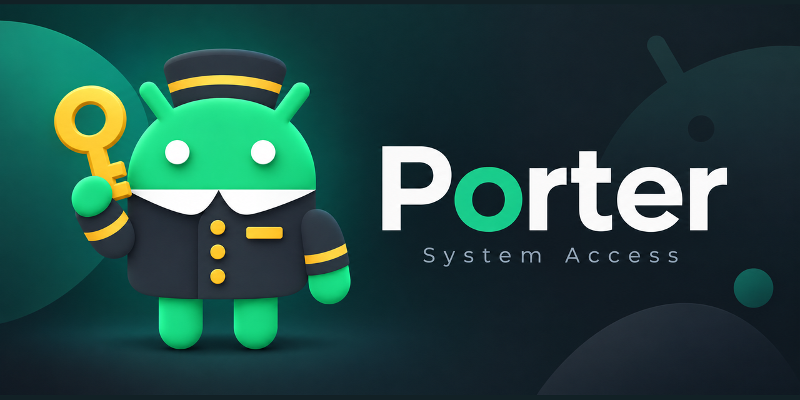

# Porter

**ADB access for your apps.**

Porter is a minimal, maintained fork of [Shizuku](https://github.com/thedjchi/Shizuku) that gives Android apps ADB access through the Shizuku APIs, with optional root support.

Use it with compatible apps to manage other apps and access additional files. You choose which apps get access.

### Why Porter exists

I use Shizuku in my own apps, [SD Maid SE](https://github.com/d4rken-org/sdmaid-se) and [Butler](https://github.com/d4rken-org/butler). The original Shizuku app was no longer actively maintained, so I started Porter to keep a minimal, stable and maintained alternative available for apps that need ADB access.

## Get started

1. Install Porter from [GitHub Releases](https://github.com/d4rken-org/porter/releases).
2. [Start Porter](https://porter.darken.eu/setup.html) using wireless debugging, a computer, or root.
3. Open an app that supports Porter and approve its access request.

Porter requires Android 7.0 or newer. Starting without a computer requires Android 11 or newer with wireless debugging, or an already rooted device. After restarting your device, start Porter again before using apps that rely on it.

## Using apps that support Shizuku

Apps with built-in Porter support only need Porter. For apps that only support Shizuku, install the optional **Porter Compatibility** APK from the same release.

**Porter Compatibility replaces the installed Shizuku app.** Remove Shizuku before installing it. Porter itself can be installed alongside Shizuku, but the compatibility companion cannot.

[Choose the right setup for your apps](https://porter.darken.eu/compatibility.html).

## For users

Read the [Porter user guide](https://porter.darken.eu/), available in English and German with automatic language selection.

## For developers

Other app developers are welcome to support Porter's permission directly. [Add direct Porter support to your app](https://porter.darken.eu/developers.html).

## About

Porter builds on [RikkaApps/Shizuku](https://github.com/RikkaApps/Shizuku) and the maintenance work by [thedjchi and contributors](https://github.com/thedjchi/Shizuku). It is not affiliated with the original Shizuku maintainers.

Porter's code is available under [Apache 2.0](LICENSE); the bundled Shizuku API uses the MIT license. See [NOTICE](NOTICE) for attribution.
